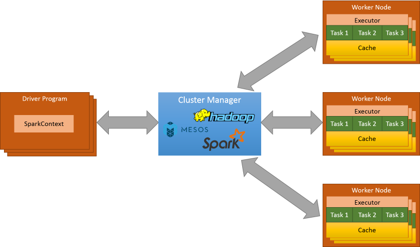
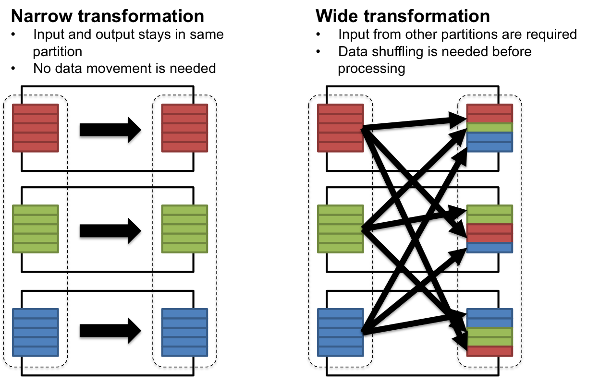

# Spark Core

Spark Core is the foundational and central component of the Apache Spark framework. It provides the basic functionality and the essential building blocks for distributed data processing in Spark. Here's a detailed explanation of Spark Core:

**1. Resilient Distributed Datasets (RDDs):**

- RDD is the primary data abstraction in Spark Core. It represents an immutable, distributed collection of objects that can be processed in parallel. RDDs are fault-tolerant and can be recomputed in case of node failure.

**2. Transformation and Action Operations:**

- **Transformations:** Transformations are operations that create a new RDD from an existing one. Examples include `map`, `filter`, and `reduceByKey`. Transformations are lazily evaluated, meaning they are not executed immediately but build up a logical execution plan.
- **Actions:** Actions are operations that trigger the execution of the computation and return values to the driver program or write data to an external storage system. Examples include `count`, `collect`, and `saveAsTextFile`.

**3. Parallel Processing:**

- Spark Core enables parallel processing of data by distributing it across a cluster of machines. Each node in the cluster processes a portion of the data in parallel, allowing for efficient and scalable data processing.

**4. Fault Tolerance:**

- Spark Core achieves fault tolerance through the lineage information stored for each RDD. If a partition of data is lost due to a node failure, Spark can recompute the lost data using the lineage information, ensuring resilience in distributed environments.

**5. Task Execution:**

- Spark Core breaks down a Spark job into smaller tasks and executes them on worker nodes. These tasks can run in parallel on different nodes, making use of the available resources in the cluster.

**6. Job Scheduling:**

- Spark Core includes a cluster manager (like standalone, YARN, or Mesos) for job scheduling and resource allocation. The cluster manager assigns tasks to worker nodes and manages the overall execution of Spark applications.

**7. Caching and Persistence:**

- Spark Core allows the caching of intermediate data in memory to avoid recomputation, improving performance. Users can choose to persist RDDs in memory or on disk for reuse in subsequent stages of computation.

**8. Language Support:**

- Spark Core is designed to be language-agnostic. While it is primarily used with Scala, it also provides APIs for Java, Python, and R. This flexibility allows developers to choose the programming language that suits their preferences.

**9. Data Sources:**

- Spark Core supports various data sources, including HDFS, local file systems, HBase, and more. It can read and write data from and to different storage systems, making it versatile for different use cases.

# Spark Architecture


Apache Spark has a flexible and scalable architecture that allows it to efficiently process large-scale data across distributed clusters. The architecture comprises various components working together to achieve parallel and fault-tolerant data processing. Here's an overview of the key components in Spark's architecture:

1. **Driver Program:**

   - The driver program is the main entry point for Spark applications. It runs the user's main function and creates a SparkContext to coordinate the execution of tasks on a cluster.
2. **SparkContext:**

   - SparkContext is the entry point to any Spark functionality. It establishes a connection to a Spark cluster and manages the distributed computing resources. The SparkContext coordinates the execution of tasks across the worker nodes.
3. **Cluster Manager:**

   - Spark supports multiple cluster managers, such as standalone, Apache Mesos, and Apache Hadoop YARN. The cluster manager is responsible for allocating resources (CPU, memory) and managing the execution of Spark applications across the worker nodes.
4. **Worker Node:**

   - Worker nodes are machines in the cluster that execute tasks assigned by the SparkContext. Each worker node has its own executor processes to run tasks in parallel. The worker nodes communicate with the driver program and the cluster manager.
5. **Executor:**

   - Executors are processes that run on worker nodes and are responsible for executing tasks. They manage the execution environment, cache data, and perform in-memory computations. Executors communicate with the driver program and the cluster manager to receive tasks and report results.
6. **Task:**

   - A task is the smallest unit of work in Spark. It is a computation that operates on a partition of data and is executed on an executor. Tasks are created by the SparkContext and sent to worker nodes for parallel processing.
7. **Resilient Distributed Datasets (RDDs):**

   - RDDs are the fundamental data abstraction in Spark. They represent an immutable, distributed collection of objects that can be processed in parallel. RDDs are partitioned across the cluster, and each partition is processed by a separate task.
8. **Job:**

   - A job in Spark is a sequence of tasks triggered by an action (e.g., `collect`, `count`). A job is divided into stages, where each stage consists of tasks that can be executed in parallel.
9. **Stage:**

   - A stage is a set of tasks that can be executed in parallel without shuffling data between them. Stages are determined by transformations that require data to be reorganized, such as `shuffle` operations.
10. **Driver Program DAGScheduler:**

    - The DAGScheduler is responsible for translating a user's Spark application into a directed acyclic graph (DAG) of stages and tasks. It optimizes the execution plan and schedules tasks for execution.
11. **Shuffle Operations:**

    - Shuffle operations involve redistributing data across the cluster, often occurring between stages. Examples include `groupByKey` and `reduceByKey`. Shuffle operations can be resource-intensive and impact performance.
12. **Broadcast Variables and Accumulators:**

    - Spark supports broadcast variables for efficiently sharing read-only variables across tasks and accumulators for aggregating values across tasks in a parallel and fault-tolerant manner.

Understanding these components helps in grasping how Spark applications are executed, how data is distributed, and how fault tolerance is achieved in a distributed computing environment.

# How Spark Work Step By Step Procees...



Let's break down the step-by-step working process of Apache Spark from the initiation of a Spark application to the completion of tasks. Here's a simplified overview:

1. **Initialization:**

   - The Spark application begins with the initialization of the driver program. The driver program contains the user's application code and creates a SparkContext, which serves as the entry point to Spark functionality.
2. **SparkContext Initialization:**

   - The SparkContext establishes a connection to the cluster manager, whether it's standalone, Mesos, or YARN. It requests resources from the cluster manager to allocate CPU cores and memory for the application.
3. **Resource Allocation:**

   - The cluster manager allocates resources to the Spark application based on the specified requirements and the available resources in the cluster. This includes the assignment of worker nodes, CPU cores, and memory.
4. **Task Scheduling:**

   - The driver program breaks down the Spark application into stages, and each stage comprises tasks that can be executed in parallel. The DAGScheduler translates the logical execution plan into a Directed Acyclic Graph (DAG) of stages and tasks.
5. **Stages and Tasks:**

   - Spark divides the application into stages based on transformations that require data shuffling, such as `groupByKey` or `reduceByKey`. Each stage is further divided into tasks that can be executed independently.
6. **Task Execution on Executors:**

   - Executors on worker nodes run tasks in parallel. These tasks correspond to the units of work defined by the application logic. Executors manage the allocated memory for executing tasks, including storage and execution memory.
7. **Data Processing:**

   - During task execution, data is processed in-memory, and transformations are applied to RDDs. Intermediate results and shuffle data are efficiently managed within the allocated memory.
8. **Shuffle Operations:**

   - If the application involves shuffle operations, Spark performs data exchange between executors during the execution of specific tasks. This may include the exchange of grouped or reduced data between partitions.
9. **Result Storage:**

   - Intermediate and final results of computations are stored in the allocated memory on the executor. Spark optimizes the storage and retrieval of data to minimize data transfer and improve performance.
10. **Task Completion:**

    - Executors report the completion of tasks to the driver program, which monitors the progress of the application. Successfully completed tasks contribute to the overall progress of the Spark job.
11. **Job Completion:**

    - As all stages and tasks are successfully completed, the Spark job finishes its execution. The driver program may collect and display the final results or write them to an external storage system.
12. **SparkContext Shutdown:**

    - After the application completes, the SparkContext is shut down gracefully. This releases the allocated resources and concludes the Spark application.

Understanding this step-by-step process provides insights into how Spark manages resources, schedules tasks, performs in-memory computations, and achieves parallel and distributed data processing. Keep in mind that this is a high-level overview, and the actual execution may involve more complexities and optimizations based on the specifics of the Spark application

# How Pyspark work With The Help Of API...

While Apache Spark is primarily written in Scala, it provides APIs in multiple languages, including Python, Java, and R. The key to this cross-language support is the use of a language-agnostic data structure called Resilient Distributed Dataset (RDD) and a well-defined API. Let's break down how this works, especially focusing on the interaction between Scala and Python:

1. **Spark Core in Scala:**

   - The core functionalities of Apache Spark, including the execution engine and RDD abstraction, are implemented in Scala. Scala provides a concise and expressive way to express distributed data processing operations.
2. **PySpark API for Python:**

   - PySpark is the Python API for Spark, which enables Python developers to interact with Spark functionality. PySpark provides a Pythonic interface to Spark, allowing users to write Spark applications using Python syntax.
3. **Data Serialization:**

   - RDDs are the primary data abstraction in Spark. They represent distributed collections of objects that can be processed in parallel. RDDs are serialized and stored in a language-agnostic format. This serialization allows Spark to seamlessly interact with different language APIs.
4. **Py4J:**

   - The interaction between Python and Scala in Spark is facilitated by a library called Py4J. Py4J enables communication between the Python interpreter and the Java Virtual Machine (JVM), where Spark is running.

   
5. **Driver Program in Python:**

   - The driver program, where the main Spark application is executed, can be written in Python using PySpark. This Python program communicates with the SparkContext and creates RDDs and performs transformations and actions using PySpark API functions.
6. **Execution on Executors:**

   - The actual execution of tasks (transformations and actions) happens on the Spark executors, which are Java processes running on worker nodes. The tasks are executed in the JVM, and the SparkContext manages the distribution and execution of these tasks.
7. **Inter-Language Communication:**

   - When the driver program written in Python interacts with Spark, Py4J bridges the communication gap between Python and the underlying Spark engine in the JVM. It allows Python code to trigger Spark operations and retrieve results seamlessly.
8. **Data Movement and Processing:**

   - Data movement and processing operations (e.g., shuffling, transformations) are performed in the Scala-based Spark engine. The Spark engine efficiently manages the distributed processing of data, regardless of the language used to express the operations.

In summary, the PySpark API acts as a bridge between Python and the Spark engine implemented in Scala. Py4J facilitates communication between the Python interpreter and the JVM, allowing Python code to seamlessly interact with the Spark engine and leverage its distributed processing capabilities. The use of a common data structure (RDD) and well-defined APIs ensures a consistent and language-agnostic experience across different programming languages.

### Partitions

To allow every executor to perform work in parallel, Spark breaks up the data into chunks called
partitions. A partition is a collection of rows that sit on one physical machine in your cluster. A
DataFrame’s partitions represent how the data is physically distributed across the cluster of
machines during execution. If you have one partition, Spark will have a parallelism of only one,
even if you have thousands of executors. If you have many partitions but only one executor,
Spark will still have a parallelism of only one because there is only one computation resource.


# Transformations

In Apache Spark, transformations are operations that produce a new Resilient Distributed Dataset (RDD) or DataFrame from an existing one. Transformations are performed on distributed collections of data, and they are the building blocks for constructing Spark applications. Transformations in Spark are lazy, meaning they are not executed immediately. Instead, they create a logical execution plan, and the actual computation is deferred until an action is triggered.

 In the context of Apache Spark, transformations are categorized into two types: narrow transformations and wide transformations. These classifications are based on how Spark computes the result and the dependency structure between partitions of the parent and child RDDs.

1. **Narrow Transformations:**

   - **Definition:** Narrow transformations are those transformations where each partition of the parent RDD contributes to at most one partition of the child RDD. Narrow transformations do not require shuffling of data across the partitions.
   - **Examples:**
     - `map`
     - `filter`
     - `union`
     - `flatMap`
     - `mapPartitions`

   ```python
   rdd = sc.parallelize([1, 2, 3, 4, 5])
   squared_rdd = rdd.map(lambda x: x**2)  # Narrow transformation, as each partition only affects one partition in the result.
   ```

   
2. **Wide Transformations (Shuffle Transformations):**

   - **Definition:** Wide transformations are those transformations where each partition of the parent RDD can contribute to multiple partitions of the child RDD. These transformations require data shuffling and can have a significant impact on performance.
   - **Examples:**
     - `groupByKey`
     - `reduceByKey`
     - `join`
     - `sortByKey`

   ```python
   pair_rdd = sc.parallelize([(1, 'a'), (2, 'b'), (1, 'c')])
   grouped_rdd = pair_rdd.groupByKey()  # Wide transformation, as data needs to be shuffled to group by key.
   ```

Understanding the distinction between narrow and wide transformations is crucial for optimizing Spark applications. Narrow transformations are more efficient as they don't involve data shuffling, and they can be executed in parallel on each partition. On the other hand, wide transformations may incur additional overhead due to the need for shuffling data between partitions.

It's important to design Spark workflows with awareness of these transformations, especially when dealing with large datasets, to achieve better performance and scalability.


# Lazy Evaluation and Action?

#### Lazy Evaluation:

**Lazy evaluation** refers to the postponement of the execution of transformations until an action is invoked. When you apply transformations to an RDD or DataFrame in Spark, the operations are not immediately executed. Instead, Spark builds a logical execution plan, creating a lineage of transformations.

The benefits of lazy evaluation include:

1. **Optimization Opportunities:**

   - Spark can optimize the execution plan by combining multiple transformations into a single stage and minimizing data shuffling.
2. **Reduced Data Movement:**

   - Unnecessary data movement and computations are avoided until they are actually needed, reducing unnecessary overhead.
3. **Efficient Execution:**

   - Transformations are only executed when an action requires the final result. This improves the efficiency of Spark programs.

**Example of Lazy Evaluation:**

```python
# Lazy evaluation: No computation happens here
rdd = sc.parallelize([1, 2, 3, 4, 5])
mapped_rdd = rdd.map(lambda x: x**2)
```

### Actions:

**Actions** are operations in Spark that trigger the execution of the previously defined transformations. They are the operations that return results to the driver program or write data to an external storage system. Actions are the catalysts for the actual computation of the transformations.

Common actions include:

1. **`collect()`:**

   - Retrieves all elements of an RDD or DataFrame to the driver program.

   ```python
   collected_data = mapped_rdd.collect()  # Action triggers the computation and returns results.
   ```
2. **`count()`:**

   - Returns the number of elements in an RDD or DataFrame.

   ```python
   num_elements = mapped_rdd.count()  # Action triggers the computation and returns the count.
   ```
3. **`saveAsTextFile(path)`:**

   - Writes the elements of an RDD to a text file.

   ```python
   mapped_rdd.saveAsTextFile("output_path")  # Action triggers the computation and writes to a file.
   ```
4. **`reduce(func)`:**

   - Aggregates the elements of an RDD using a specified function.

   ```python
   total_sum = rdd.reduce(lambda x, y: x + y)  # Action triggers the computation and returns the result.
   ```

In summary, lazy evaluation allows Spark to optimize and defer the execution of transformations until an action is called. Actions, on the other hand, are the operations that initiate the actual computation, producing results or side effects. Understanding the interplay between lazy evaluation and actions is crucial for writing efficient and performant Spark programs.


# An End-to-End Example

Let's put together an end-to-end example using various concepts we've discussed—creating an RDD, applying transformations, and triggering actions. In this example, we'll use a simple word count application, which involves reading a text file, splitting it into words, counting the occurrences of each word, and displaying the results.

```python
from pyspark.sql import SparkSession

# Step 1: Create a Spark session
spark = SparkSession.builder.appName("WordCountExample").getOrCreate()

# Step 2: Read a text file into an RDD
input_file_path = "path/to/your/textfile.txt"
lines_rdd = spark.sparkContext.textFile(input_file_path)

# Step 3: Apply transformations - Split lines into words and perform word count
words_rdd = lines_rdd.flatMap(lambda line: line.split(" "))
word_count_rdd = words_rdd.map(lambda word: (word, 1)).reduceByKey(lambda x, y: x + y)

# Step 4: Trigger actions - Collect and display the results
word_count_result = word_count_rdd.collect()

# Display the word count results
for (word, count) in word_count_result:
    print(f"{word}: {count}")

# Step 5: Stop the Spark session
spark.stop()
```

Explanation of the code:

1. **Create a Spark session:**

   - We create a Spark session using `SparkSession.builder.appName("WordCountExample").getOrCreate()`.
2. **Read a text file into an RDD:**

   - We read the contents of a text file into an RDD using `spark.sparkContext.textFile(input_file_path)`.
3. **Apply transformations:**

   - We apply transformations to split lines into words (`flatMap`) and perform word count (`map` and `reduceByKey`).
4. **Trigger actions:**

   - We collect and display the results using `word_count_rdd.collect()`.
5. **Stop the Spark session:**

   - Finally, we stop the Spark session using `spark.stop()`.

Make sure to replace `"path/to/your/textfile.txt"` with the actual path to your text file. This example demonstrates the end-to-end process of reading a file, applying transformations, triggering actions, and displaying the results using Apache Spark in Python.
